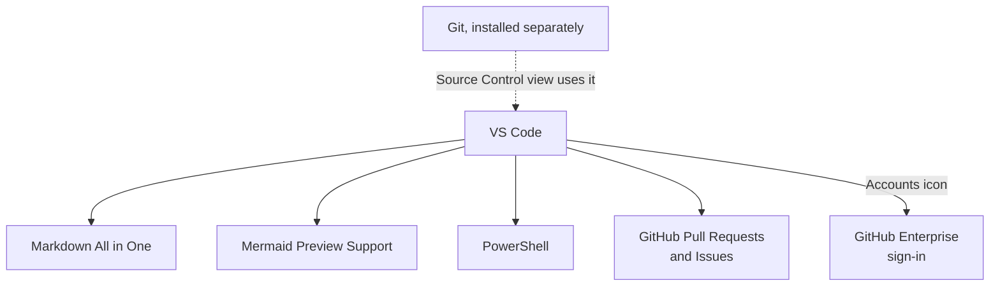

# Extra: Setting Up Your Local Dev Environment

**Audience:** Anyone about to start Session 2 (or any command-line work)
without Git or VS Code installed yet, or without VS Code connected to the
company's GitHub Enterprise account.

**Format:** Hands-on installs, done once. Mostly waiting on installers, not
reading.

**Timing budget:** ~30 minutes, most of it install time.

## Why this exists

Session 2 assumes `git` is already installed and working. This is where
that assumption gets satisfied — install Git, install VS Code, connect VS
Code to GitHub Enterprise, and pick up a few extensions worth having from
day one. Extra tier, not core curriculum: come back to this whenever you
need it, it doesn't gate anything else in the program.


What this shows: four one-time setup steps, in order — each one is
independent and skippable if already done, but do them in this order the
first time since VS Code's GitHub sign-in step goes more smoothly with Git
already present.

## 1. Install Git (Windows)

Fastest path, from a terminal (PowerShell or Command Prompt):

```powershell
winget install --id Git.Git -e --source winget
```

No `winget`, or it fails: download the installer directly from
[git-scm.com/downloads](https://git-scm.com/downloads) and run it — the
default options are fine for everyday use.

Confirm it worked in a **new** terminal window (installers don't update
windows already open):

```bash
git --version
```

## 2. Install VS Code

Download from [code.visualstudio.com](https://code.visualstudio.com) and
run the installer — default options are fine here too. On first launch,
VS Code offers to install the command-line `code` command; accept it, it's
useful later for opening folders from a terminal (`code .`).

## 3. Connect VS Code to GitHub Enterprise

- Click the **Accounts** icon (bottom-left corner of VS Code).
- **Sign in with GitHub** (or **GitHub Enterprise** if your organization
  uses a custom Enterprise URL rather than github.com — check with your
  facilitator or admin which applies to you before starting this step).
- This opens a browser window to complete sign-in; if your organization
  requires SSO (single sign-on) on top of your GitHub credentials, you'll
  be prompted for that too — same as signing into any other company tool.
- Once signed in, the Accounts icon shows your GitHub username, and VS
  Code's Source Control view can now clone, push, and pull against
  repositories you have access to without re-entering credentials each
  time.

## 4. Recommended extensions

| Extension | Why it earns a spot |
| --- | --- |
| **Markdown All in One** (or similar) | Live preview and formatting help for `.md` files — this program's material, and most team documentation, is Markdown. |
| **Markdown Preview Mermaid Support** | Renders Mermaid diagrams (like the flowcharts in this very page) inline in VS Code's Markdown preview, not just on GitHub.com. |
| **PowerShell** | Syntax highlighting and linting for `.ps1` scripts — relevant if you ever read or run this repo's own `install-skills.ps1`, or any other PowerShell tooling. |
| **GitHub Pull Requests and Issues** | Review, comment on, and manage PRs and issues from inside VS Code instead of switching to a browser — pairs directly with what Session 2 teaches on the command line. |

Install any of these from VS Code's Extensions view (the four-squares icon
in the left sidebar, or `Ctrl+Shift+X`) — search the name, click Install.



What this shows: VS Code is the hub — Git runs underneath it (Source
Control view calls out to your local Git install), GitHub Enterprise
sign-in connects it to the shared repos, and the four extensions each add
one specific capability on top.

## Self-check

- Can you open a terminal in VS Code and run `git --version` successfully?
- Does the Accounts icon show your GitHub username, not a "Sign in" prompt?
- Can you find the Extensions view without help?

Not confident on any of these? Re-run the relevant numbered step above —
each one is independent, so there's no need to start over.

## Feedback

Something unclear, wrong, or worth improving on this page? Open a
Discussion in this repo (**Ideas** category). Concrete, actionable
feedback gets converted into a tracked issue, per this repo's own
issue-first convention — see `skills/github-issue-first/SKILL.md`'s
Discussions section.

---

Next: [Session 2: Local Git Basics](../beginners/session-2-local-git-basics.md)
now that `git` is installed — or, if you're setting up VS Code specifically
to use this repository's own skills (Claude/Copilot), see
[docs/vscode.md](../../docs/vscode.md) for that install step instead.
