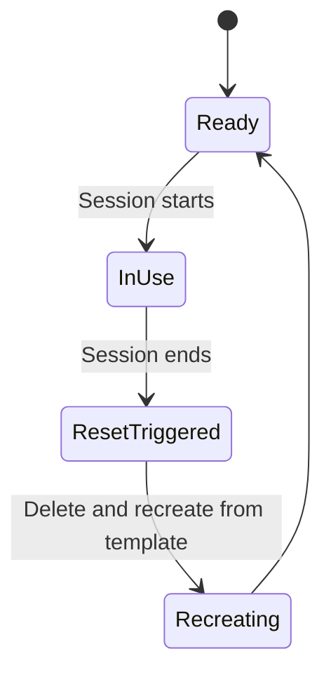

# Facilitator Guide

This file is for whoever is **running** a session, not for attendees.

## Sandbox repo requirements

Sessions need one shared practice repository, separate from any real
project. Requirements:

- **Private**, never public — this is internal practice material and
  attendees will be pushing throwaway commits to it.
- **One shared repo per cohort**, not one fork per attendee. Session 1's
  walkthrough steps assume everyone is working in the same repo with the
  same file (`CONTRIBUTORS.md`) — this keeps the steps identical for
  everyone and avoids fork-specific complications a true beginner
  shouldn't have to think about yet.
- **Seed content:** a `README.md` explaining it's a practice repo, and a
  `CONTRIBUTORS.md` file with a header line and nothing else (attendees
  each add their own line to it during Session 1).
- **Reset between cohorts:** recreate the repo from a template rather
  than manually reverting commits — faster, and guarantees a clean state
  every time.

What this shows: the repo's lifecycle across sessions — always reset back
to `Ready` before the next cohort starts, never reused mid-state.



## Before each session

- [ ] Confirm the sandbox repo is in the `Ready` state (recreated since the last run).
- [ ] Confirm every attendee has at least write access to it.
- [ ] For Session 1: confirm `CONTRIBUTORS.md` exists with just a header line.
- [ ] Have this guide and the relevant session file open, ideally projected.

## Running Session 1 for a single new hire

Session 1 works the same for one person as for a group — the sandbox
repo doesn't need to be freshly reset for a solo run if `CONTRIBUTORS.md`
already has other names in it from prior cohorts; that's expected and
harmless, since each attendee adds their own line.

## Tracking completion

No separate tracking system — add a checkbox for "GitHub training
(Session 1 + 2)" to whatever onboarding checklist or issue already exists
for new hires. That's the entire mechanism; don't build more than this
needs.

## Extract your org's real settings before Session 2/3

Session 2 and 3's talking points on branch protection, required
approvals, and Actions permissions will vary by employer. **Run these in
your own environment** — never commit real output from these into this
public repository:

```bash
# Org-level policy
gh api orgs/{org} --jq '{default_repo_permission, members_can_create_repositories, two_factor_requirement_enabled}'

# Actions permissions
gh api orgs/{org}/actions/permissions

# Org-level rulesets (branch protection applied across repos)
gh api orgs/{org}/rulesets --jq '.[] | {name, target, enforcement}'

# Per-repo security settings (loop over a sample of real repos)
gh api repos/{org}/{repo} --jq '.security_and_analysis'
```

Use the output to adapt Session 3's branch-protection and security
talking points to what's actually true at your organization — for
example, if rulesets are already enforced org-wide, say so explicitly
rather than presenting it as a hypothetical decision tree. Keep the
actual extracted values in your own private notes, not in this repo.

## Common questions (anticipated from Session 1)

- **"Why can't I just email my change to someone?"** — Because then
  nobody else can see it happened, review it, or find it again later. The
  issue/PR trail is the point.
- **"What if I mess up my branch?"** — You can't break `main` from a
  branch. Worst case, delete the branch and start over from step 2.
- **"Do I need to install anything?"** — No, for Session 1. Session 2
  onward introduces the command-line equivalents for people who want
  them, but the web UI remains a fully valid way to work.
