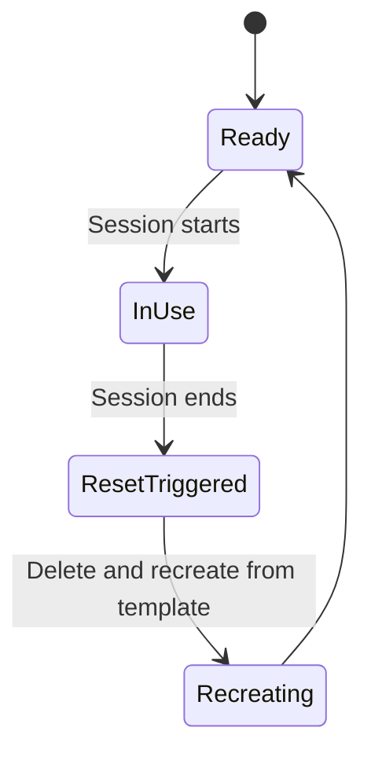

# Facilitator Guide

This file is for whoever is **running** a session, not for attendees.

## Tools policy

For now, everyone does all Git activity in **VS Code or on the command line**.
The lessons and exercises assume one of those two, and GitHub Desktop and other
Git clients are deliberately not covered (maintainer decision, issue #178). If
an attendee arrives using another client, ask them to switch to VS Code or the
command line for the session. Do not improvise steps for a client the material
does not cover; the commands and button names will not match the lesson.

## Sandbox repo requirements

Sessions need one shared practice repository, separate from any real
project. Requirements:

- **Private**, never public — this is internal practice material and
  attendees will be pushing throwaway commits to it.
- **One shared repo per cohort**, not one fork per attendee. Module 1.1's
  walkthrough steps assume everyone is working in the same repo with the
  same file (`CONTRIBUTORS.md`) — this keeps the steps identical for
  everyone and avoids fork-specific complications a true beginner
  shouldn't have to think about yet.
- **Seed content:** a `README.md` explaining it's a practice repo, and a
  `CONTRIBUTORS.md` file with a header line and nothing else (attendees
  each add their own line to it during Module 1.1).
- **For Module 1.2's exercises:** each attendee needs `git` installed locally
  and clone access to the sandbox repo — nothing on the repo itself beyond
  what Module 1.1 already needs (`CONTRIBUTORS.md` with a header line).
  Attendees push throwaway branches (`conflict-a`, `conflict-b`, scratch
  branches for the undo exercises); the cohort reset already handles
  cleaning these up, no extra step needed.
- **For Module 1.3's exercise:** nothing beyond what Module 1.1 leaves behind.
  Each attendee needs the issue and merged pull request they made in Module 1.1
  (the exercise links to both), so run it after 1.1 in the same sandbox. They
  close their practice issue as "Not planned" themselves.
- **For Modules 2.1/2.2's exercises:** at least one priority label (e.g.
  `P0`-`P3`, matching `skills/github-issue-first/SKILL.md`'s scheme) and
  one category label beyond GitHub's defaults, plus at least one open
  milestone with any title — Module 2.2's exercise attaches an issue to an
  existing milestone, so the repo needs one to attach to.
- **For Module 2.3's exercise:** one seeded issue titled "Fix the badge bug"
  whose body says only "it's broken sometimes", with no labels, milestone, or
  assignee, plus the same priority labels, category label, and open milestone
  as Modules 2.1/2.2. Attendees rewrite it, then close it as "not planned"
  with a short comment; recreate the seeded issue for each cohort.
- **For Module 2.4's exercise:** a branch named `practice/oversized` with one
  commit that changes two unrelated files (a typo fix in `README.md` and a new
  line in `CONTRIBUTORS.md`), a pull-request template, and at least one open
  issue for attendees to reference. The template in
  `skills/github-repo-configure/templates/pull_request_template.md` is a good
  generic one to copy. Attendees close their pull requests unmerged and delete
  their branches; recreate the seeded branch for each cohort.
- **For Module 2.5's exercise:** six open issues, all priority `P2` with no
  milestone: "Support the legacy browser" (obsolete), "Add CSV export" (a
  duplicate of the next), "Export data as CSV" (the older real request),
  "Upgrade the parsing library" (needed by the next two), "Add JSON export",
  and "Add scheduled exports". Also the priority labels and at least one open
  milestone. Attendees close two of them and edit the rest; recreate the six
  issues for each cohort.
- **For Module 2.6's exercise:** a `decision-needed` label, and (optional, for
  the Discussion step) Discussions enabled with an Ideas category. Attendees
  open a draft pull request for a practice decision record and close it
  unmerged, and file one practice issue that they close as "not planned";
  reset the sandbox between cohorts.
- **For Module 2.7's exercise:** a separate **public** practice repository
  (for example `practice-contributions`), because the private sandbox can't
  normally be forked. It needs a `CONTRIBUTORS.md`, and a `CONTRIBUTING.md`
  whose rules differ from this team's habits (for example a title prefix such
  as `[docs]`, a one-sentence description, and no issue reference), so
  attendees practise following the target's rules. Optionally add a workflow
  job that needs a secret, so attendees see it skipped on a fork pull request.
  Attendees close their pull requests unmerged; delete stray forks and branches
  between cohorts.
- **For Module 3.2's exercise:** a Projects v2 board with at least one item
  linked to a real issue, and one deliberately unlinked **draft item** (an
  entry created only on the board) — the module's exercise asks attendees
  to find exactly this draft item as a live example of the failure mode it
  teaches.
- **Reset between cohorts:** recreate the repo from a template rather
  than manually reverting commits — faster, and guarantees a clean state
  every time.

What this shows: the repo's lifecycle across sessions — always reset back
to `Ready` before the next cohort starts, never reused mid-state.



## Before each session

- [ ] Confirm the sandbox repo is in the `Ready` state (recreated since the last run).
- [ ] Confirm every attendee has at least write access to it.
- [ ] For Module 1.1: confirm `CONTRIBUTORS.md` exists with just a header line.
- [ ] For Module 1.2: confirm every attendee has `git` installed and can clone the sandbox repo.
- [ ] For Module 1.3: confirm each attendee still has their Module 1.1 issue and
      merged pull request to link to.
- [ ] For Modules 2.1/2.2: confirm at least one priority label, one category
      label, and one open milestone exist on the sandbox repo.
- [ ] For Module 2.3: confirm the seeded vague issue ("Fix the badge bug")
      exists, unlabeled and unassigned.
- [ ] For Module 2.4: confirm the `practice/oversized` branch exists and the
      sandbox has a pull-request template and an open issue.
- [ ] For Module 2.5: confirm the six seeded triage issues exist, all `P2`
      and without a milestone.
- [ ] For Module 2.6: confirm the `decision-needed` label exists and, if you want
      the Discussion step, that Discussions is enabled with an Ideas category.
- [ ] For Module 2.7: confirm the public practice repository exists, is public,
      and has a `CONTRIBUTORS.md` and a `CONTRIBUTING.md`.
- [ ] For Module 3.2: confirm the sandbox repo has a Projects board with at
      least one item linked to a real issue and one unlinked draft item.
- [ ] Have this guide and the relevant session or module file open,
      ideally projected.

## Running Module 1.1 for a single new hire

Module 1.1 works the same for one person as for a group — the sandbox
repo doesn't need to be freshly reset for a solo run if `CONTRIBUTORS.md`
already has other names in it from prior cohorts; that's expected and
harmless, since each attendee adds their own line.

## Tracking completion

No separate tracking system — add a checkbox for "GitHub training
(Beginner modules 0.1-1.3 / Intermediate modules 2.1-2.7 / Advanced modules 3.1-3.6)" to
whatever onboarding checklist or issue already exists for new hires. Track
at that coarse, three-bucket granularity — not one checkbox per module —
since per-module tracking is more overhead than this mechanism needs.
That's the entire mechanism; don't build more than this needs.

## Facilitator-note callouts in self-paced modules

The six modules under `intermediate/` and `advanced/` are written primarily
for solo, self-paced reading — but they still support a facilitator-led
session. Optional group activities are marked inline as blockquotes
starting with `**Facilitator note`. When running a live session, watch for
these as you go and decide in the moment whether to run the group activity
or let attendees read past it — they're written so either choice works
without breaking the flow of the module. A solo self-paced learner reading
the same file will naturally skip these, since nothing about them is
required to complete the module.

## Extract your org's real settings before the advanced modules

Modules 3.1-3.4's talking points on branch protection, required approvals,
and Actions permissions will vary by employer. **Run these in your own
environment** — never commit real output from these into this
public repository:

```bash
# Org-level policy
gh api orgs/{org} --jq '{default_repo_permission, members_can_create_repositories, two_factor_requirement_enabled}'

# Actions permissions
gh api orgs/{org}/actions/permissions

# Org-level rulesets (branch protection applied across repos)
gh api orgs/{org}/rulesets --jq '.[] | {name, target, enforcement}'

# Per-repo security settings (loop over a sample of real repos)
gh api repos/{org}/{repo} --jq '.security_and_analysis'
```

Use the output to adapt the advanced modules' branch-protection and
security talking points to what's actually true at your organization —
for example, if rulesets are already enforced org-wide, say so explicitly
rather than presenting it as a hypothetical decision tree. Keep the
actual extracted values in your own private notes, not in this repo.

## Common questions (anticipated from Module 1.1)

- **"Why can't I just email my change to someone?"** — Because then
  nobody else can see it happened, review it, or find it again later. The
  issue/PR trail is the point.
- **"What if I mess up my branch?"** — You can't break `main` from a
  branch. Worst case, delete the branch and start over from step 2.
- **"Do I need to install anything?"** — No, for any of it. Module 1.2
  introduces the command line for people who want it, but every module,
  including 2.1 onward, still works entirely through the web UI.
