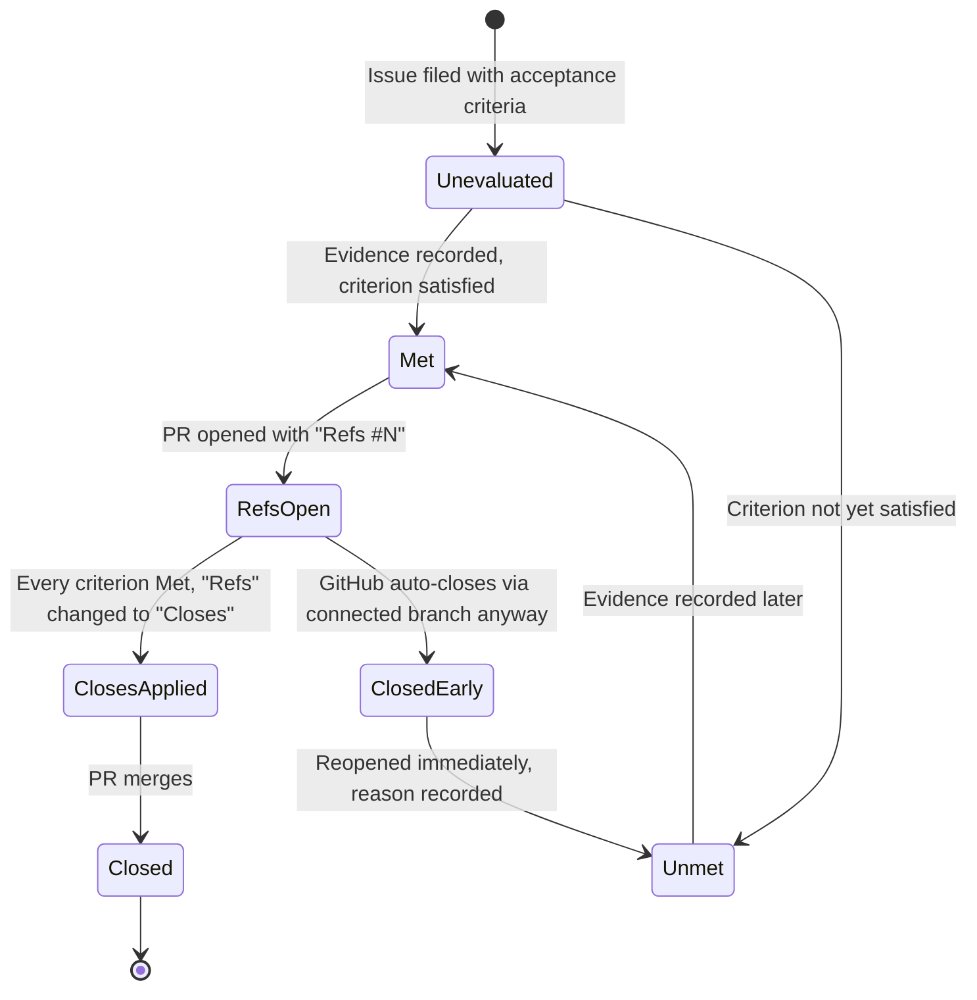
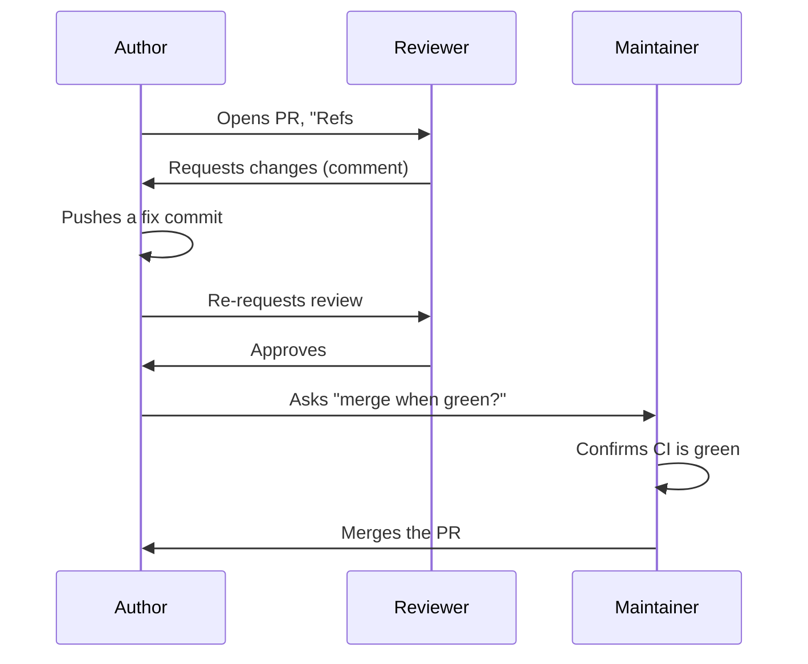

# Session 2: Our Workflow

**Audience:** Anyone who's done Session 1, or already knows git/GitHub/GitLab/Azure DevOps and read the mapping skill as pre-reading.
**Format:** Outline and talking points for the facilitator — not a script to read verbatim.
**Timing budget:** ~1-2 hours.

This session covers the specific conventions this team uses on top of
plain GitHub. Every section names the `skills/*/SKILL.md` file with the
full policy — this outline is the talking points, not the source of truth.

## Learning objectives

- Understand why work starts with an issue, not a branch or a PR.
- Understand the acceptance-criteria closure gate and why `Refs`/`Closes`
  matters.
- Know the branch and PR-review conventions well enough to follow them
  without checking the skill file every time.
- Understand what a milestone is (and isn't) here.

## Section 1: Issue-first (~15 min)

**Source:** `skills/github-issue-first/SKILL.md`

Talking points:

- Every piece of work starts as a filed issue — even small ones. The
  tracker is the source of truth for "things we know about"; if it only
  lived in a chat message, it's effectively lost.
- What a well-formed issue needs: a title stating the problem (not the
  fix), a body with enough context to act on later, one priority label,
  at least one category label, an assignee, and a milestone.
- The one exception: if someone explicitly says "just fix it," skip the
  ceremony for that one thing.

Suggested activity: as a group, look at 2-3 real closed issues in this
repo and identify their priority/category labels and acceptance criteria.

## Section 2: The closure gate — `Refs` vs `Closes` (~25 min)

**Source:** `skills/github-hygiene/SKILL.md` (the acceptance-criteria
closure gate section), `docs/adr/0001-refs-closes-connected-branch-closure.md`

What this shows: the states a piece of work moves through, and the one
gotcha (the right-hand branch) that catches almost everyone the first
time.

Talking points:

- A PR body starting with `Refs #N` means "this is progress on issue N,
  not necessarily finished." `Closes #N` means "merging this PR should
  close issue N."
- **The gotcha (the `ClosedEarly` branch above):** using `Refs #N` does
  **not** guarantee the issue stays open. If GitHub created a "connected
  branch" link (e.g. via "create a branch" from the issue, like in
  Session 1), merging the PR can auto-close the issue anyway — even
  though the PR body only said `Refs`, not `Closes`. This actually
  happened once in this repo's own history (see ADR 0001) and is exactly
  why the habit below exists.
- **The habit this creates:** after *every* merge, check the linked
  issue. If it closed early while a criterion was still unmet, reopen it
  immediately and write down why.
- Green CI, a merged PR, or a deadline are never themselves evidence that
  a criterion is met — the evidence is a diff, a test, a screenshot, or a
  reproduction, recorded on the issue.

Suggested activity: read ADR 0001's Context section together — it's a
short, concrete story of exactly this gotcha happening for real.

## Section 3: PR review etiquette (~20 min)

**Source:** `skills/github-pr-review/SKILL.md`

What this shows: review is a back-and-forth involving three roles, not a
single yes/no gate — and merging is a separate decision from approving.

Talking points:

- Approving a PR is not the same as merging it — those are two different
  people's decisions in most teams, and even when they're the same
  person, they're still two separate checks.
- `Request changes` means "this can't merge yet"; `Comment` means
  "questions, not a verdict"; don't use `Comment` when you really mean
  "this needs to change."
- Never approve your own PR to get around a required-review rule.

## Section 4: Branch conventions and milestones (~15 min)

**Source:** `skills/github-hygiene/SKILL.md` (PR flow), `skills/github-releases/SKILL.md`
(milestones)

Talking points:

- One branch per issue, named for what it does (`fix/…`, `feat/…`,
  `docs/…`). Branch from an up-to-date `main`, never commit on `main`
  directly.
- A milestone is a **release bucket**, not a sprint/iteration. "What
  ships in the next release" is the question a milestone answers.
- Every issue gets a milestone at filing time, not as an afterthought.

## Wrap-up (~5 min)

Recap: issue-first, the closure gate's one real gotcha, review vs. merge
as separate decisions, milestones as release buckets. Session 3 goes into
branch protection, Projects boards, and releases for anyone who wants to
go further.

Next: [Session 3: Advanced GitHub](../advanced/session-3-advanced-github.md) (optional)
