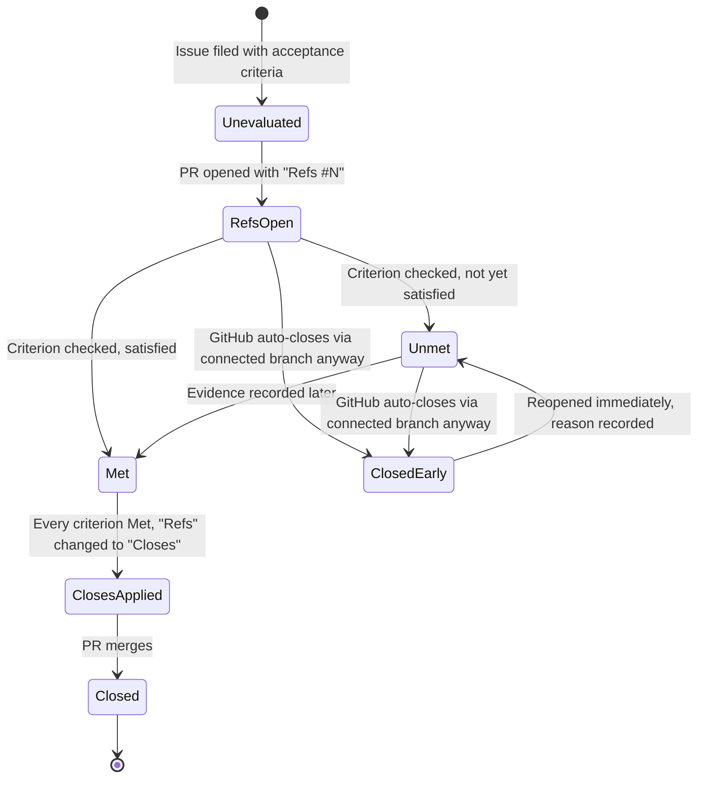
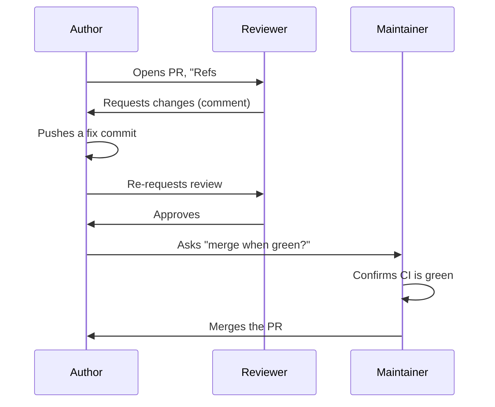

# Session 2: Our Workflow

**Audience:** Anyone who's done Session 1, or already knows git/GitHub/GitLab/Azure DevOps and read the mapping skill as pre-reading.
**Format:** Full script — read it closely, adapt the phrasing to your own voice, but the content and order are deliberate.
**Timing budget:** ~1-2 hours.

This session covers the specific conventions this team uses on top of
plain GitHub. Every section names the `skills/*/SKILL.md` file with the
full policy — this script is the taught version, not the source of truth.
If a participant asks a question this script doesn't answer, the named
skill file has the complete, current answer.

## Learning objectives

- Understand why work starts with an issue, not a branch or a PR.
- Understand the acceptance-criteria closure gate and why `Refs`/`Closes`
  matters.
- Know the branch and PR-review conventions well enough to follow them
  without checking the skill file every time.
- Understand what a milestone is (and isn't) here.

## Section 1: Issue-first (~15 min)

**Source:** `skills/github-issue-first/SKILL.md`

Open with the rule stated plainly: **every piece of work starts as a filed
issue — even small ones.** Not after you've started fixing it, not only
when someone remembers to ask. Say it, then explain why it matters more
than it sounds like it should: the issue tracker is this team's source of
truth for "things we know about." If a bug or an idea only ever lived in a
Slack message or a hallway conversation, it is — for every practical
purpose — gone the moment that conversation ends. Nobody can search for it,
link to it, or prove it was ever raised. Filing it is what makes it durable.

Walk through what a well-formed issue actually needs, one piece at a time:

- **A title that states the problem, not the fix.** "Badge falls through to
  the wrong color" is a good title; "Fix badge bug" is not — it tells the
  next reader nothing about what's actually broken.
- **A body with enough context to act on later**, including by the person
  who filed it, six weeks from now, having forgotten the details. What's
  wrong, where, how it was found, roughly what fixing it would involve.
- **Exactly one priority label** (how urgent this is) and **at least one
  category label** (what kind of work it is) — these are two different
  axes, and conflating them is a common early mistake.
- **An assignee.** An unassigned issue is easy to lose track of; someone
  should always own it, even if that someone is "whoever picks it up next."
- **A milestone**, attached at filing time — not as something to backfill
  later once the issue already has momentum.

Name the one exception explicitly, so nobody treats this as bureaucracy for
its own sake: if someone has said outright "just fix it, don't bother
filing an issue for this," that's fine — skip the ceremony for that one
specific thing. It's a scoped exception for what was actually said, not a
blanket opt-out for the rest of the session or the rest of the week.

**Suggested activity:** as a group, pull up 2-3 real closed issues in this
repo and look at them together. For each one, ask the group to identify:
what's the priority label, what's the category label, and what were the
acceptance criteria? This works best with issues that have some visible
back-and-forth in the comments — it makes the "durable record" argument
concrete rather than abstract.

## Section 2: The closure gate — `Refs` vs `Closes` (~25 min)

**Source:** `skills/github-hygiene/SKILL.md` (the acceptance-criteria
closure gate section), `docs/adr/0001-refs-closes-connected-branch-closure.md`

What this shows: the states a piece of work moves through, and the one
gotcha (the right-hand branch) that catches almost everyone the first
time.

Start with the plain-language version of the two keywords, since this is
the single most important habit in the whole session. A PR body that
starts with `Refs #N` means "this is progress on issue N, not necessarily
finished." A PR body that starts with `Closes #N` means "merging this PR
should close issue N" — it's a promise that every acceptance criterion has
already been checked against real evidence, not a formality you add once
the code looks done.

Now walk the diagram's right-hand branch slowly, because this is the part
that catches almost everyone the first time they hear it: **using `Refs #N`
does not guarantee the issue stays open.** If GitHub created a
"connected branch" link — for example, by using "Create a branch" directly
from the issue, the same way Session 1 did it — merging the PR can
auto-close the linked issue anyway, even though the PR body only ever said
`Refs`, never `Closes`. This isn't a hypothetical edge case dreamed up for
this training: it actually happened once in this repo's own history (see
ADR 0001 for the full story), and it's the entire reason the next habit
exists.

**The habit this creates:** after *every* merge — no exceptions, no "I'm
sure it's fine this time" — check the linked issue's state. If it closed
early while an in-scope criterion was still unmet or unevaluated, reopen
it immediately and write down why, right there on the issue. This isn't
extra paperwork bolted onto the process; it's the one check that catches
the exact failure mode the diagram's right-hand branch describes.

Land the point that trips people up most: green CI, a merged PR, or a
looming deadline are never themselves evidence that an acceptance
criterion is met. "It merged" and "it works" are different claims. The
actual evidence is something concrete and checkable — a diff, a test run,
a screenshot, a reproduction — recorded on the issue itself, not implied
by the fact that the code shipped.

**Suggested activity:** read ADR 0001's Context section together, out
loud, as a group. It's short and it's a concrete, real story of exactly
this gotcha happening — reading it together tends to land harder than
summarizing it, because the group hears exactly how ordinary and easy to
miss the situation was.

## Section 3: PR review etiquette (~20 min)

**Source:** `skills/github-pr-review/SKILL.md`

What this shows: review is a back-and-forth involving three roles, not a
single yes/no gate — and merging is a separate decision from approving.

Walk the sequence diagram left to right and pause on the detail that
surprises most people coming from a smaller or less formal process:
**approving a PR is not the same as merging it.** In most teams those are
two different people's decisions entirely. Even on a team where the same
person sometimes does both, they're still two separate checks happening
one after another, not one combined action — approval says "this change
is good," merging says "and now is the right time to ship it."

Spend a moment on the vocabulary of GitHub's actual review actions, since
people often use them loosely: `Request changes` means "this genuinely
can't merge yet" — it's a real blocker, not a strong suggestion.
`Comment` means "I have questions or thoughts, but this isn't a verdict
either way." A common mistake is reaching for `Comment` when what's
actually meant is `Request changes` — say this out loud, because it's an
easy habit to fall into and it quietly weakens the whole review signal.

Close the section on a firm, simple rule with no exceptions: never
approve your own PR to get around a required-review rule. If self-approval
is technically possible in a given repo's settings, that's a gap in the
settings, not permission to use it.

## Section 4: Branch conventions and milestones (~15 min)

**Source:** `skills/github-hygiene/SKILL.md` (PR flow), `skills/github-releases/SKILL.md`
(milestones)

Cover the branch-naming convention as a practical habit, not an abstract
rule: one branch per issue, named for the kind of work it is (`fix/…` for
bug fixes, `feat/…` for new functionality, `docs/…` for documentation-only
changes, and so on). Branch from an up-to-date `main` every time — pull
first, then branch — and never commit directly to `main`. This last part
connects straight back to Session 1: it's the same "we don't work directly
on `main`" habit from the very first walkthrough, just stated as policy
now instead of as a click-by-click instruction.

Then pivot to milestones, since this is the point in the session where the
group's mental model most often needs correcting: **a milestone is a
release bucket, not a sprint or an iteration.** The question a milestone
answers is "what ships in the next release?" — not "what are we working on
this week?" Teams coming from a background where iterations and delivery
buckets were the same object (a sprint that was also a release) tend to
import that assumption here, and it doesn't hold. If cadence tracking is
wanted alongside release tracking, that's a separate mechanism (a Projects
iteration field), not a second meaning bolted onto milestones.

Finish with the same discipline named in Session 1's Section 1: every
issue gets a milestone at filing time, alongside its priority and category
labels — not as an afterthought once the issue has already been triaged
and forgotten.

## Wrap-up (~5 min)

Recap out loud, in this order: issue-first as the starting discipline, the
closure gate's one real gotcha (and the after-every-merge habit that
guards against it), review and merge as two separate decisions made by
different checks, and milestones as release buckets rather than sprints.
Session 3 goes into branch protection, Projects boards, and releases for
anyone who wants to go further.

Next: [Session 3: Advanced GitHub](../advanced/session-3-advanced-github.md) (optional)
