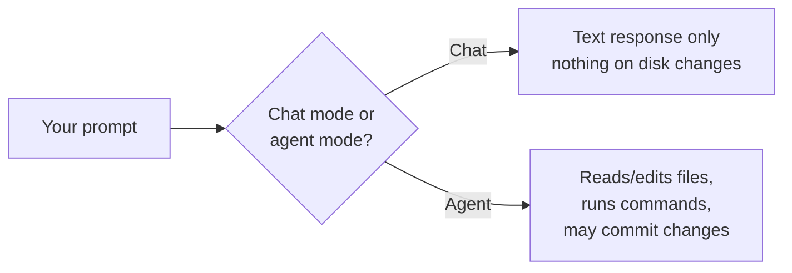

# LLM Track — Pre-requisite: What Is an LLM Assistant?

**Audience:** Anyone about to use an AI coding assistant (Claude, GitHub
Copilot, ChatGPT, or similar) for the first time — no prior experience
assumed.

**Format:** Reading only. Nothing to install yet.

**Timing budget:** ~15 minutes.

## Why this exists

Colleagues new to this tooling have consistently been surprised by the
same handful of things — not because the tools are unusual, but because
nobody explained the mechanics before they started using them. This page
is that grounding, the LLM-track equivalent of
[Session 0](../beginners/session-0-what-is-version-control.md) for the
GitHub track: read this before your first real session with any of these
tools, and the surprises below stop being surprises.

## Core vocabulary, once, in plain terms

| Term | Plain-language definition |
| --- | --- |
| **Model** | The underlying AI system generating responses — the thing actually "thinking." Claude, GPT, and Copilot's model are all different models. |
| **Prompt** | What you type or ask — an instruction, a question, a task. Everything the model responds to starts here. |
| **Context window** | How much text (your conversation, files it's read, its own prior responses) the model can "see" at once. Once a conversation or task gets long enough, older parts can drop out of view — the model isn't ignoring you, it genuinely can't see that far back anymore. |
| **Chat mode** | The assistant answers questions and writes text in a conversation — it does not touch your files or run anything on its own. |
| **Agent mode** | The assistant can read, edit, and create files, run commands, and act on your behalf — see the next section, this is the one that surprises people. |

What this shows: the same prompt can lead to two very different outcomes
depending on which mode you're in — one is purely conversational, the
other can change real things on your machine or in a repo.

## The surprise most people hit first: it can act on its own

This is the single most common first-contact surprise, so it's worth
stating directly rather than letting someone discover it mid-task: **in
agent mode, the assistant isn't limited to answering in a chat window.**
It can open files, edit them, run terminal commands, create branches, and
in some setups even make commits or open pull requests — the same kinds of
actions covered elsewhere in this program's GitHub track, just initiated
by an AI instead of typed by hand at each step.

This isn't a bug or an overreach — it's the entire point of agent mode,
and it's genuinely useful. But it means the habits that make sense for a
search engine or a chatbot (skim the answer, decide if it's useful) aren't
enough here. You're not just reading output; you're reviewing *actions*,
some of which may already have happened by the time you see the summary.
Know which mode you're in before you start, and expect to review what an
agent actually did, not just what it says it did.

## The other surprise: it can be confidently wrong

An LLM assistant can produce output that reads as complete, fluent, and
correct while being subtly wrong or entirely fabricated — this is usually
called a **hallucination**. There's no tone-of-voice difference between a
confident right answer and a confident wrong one; fluency is not evidence
of accuracy.

This is exactly why this program's GitHub track never treats "an AI wrote
it" as a reason to skip review — see [Module 3e](../advanced/module-3e-actions-runners-and-agents.md)'s
point that a PR opened by Copilot's coding agent goes through the same
review gate as a human-authored one. The same principle applies here at
the individual-use level: verify claims, run the tests, read the diff —
treat assistant output as a draft from a fast, well-read colleague who
sometimes states things with total confidence and no actual certainty,
not as a verified fact.

## Self-check

- What's the difference between chat mode and agent mode, in your own
  words?
- If an agent tells you it "updated the file," what should you do before
  trusting that's correct and complete?
- Why doesn't confident, fluent phrasing tell you an answer is accurate?

Not confident on any of these? Re-read the relevant section above.

## Feedback

Something unclear, wrong, or worth improving on this page? Open a
Discussion in this repo (**Ideas** category). Concrete, actionable
feedback gets converted into a tracked issue, per this repo's own
issue-first convention — see `skills/github-issue-first/SKILL.md`'s
Discussions section.

---

This is the first page in the LLM track (per ADR 0007) — Basics,
Intermediate, Advanced, and Extra content for this track are still to be
written; each will be linked from [Education Program
overview](../README.md) as it lands. For getting a specific tool installed
right now, see [docs/claude.md](../../docs/claude.md),
[docs/copilot.md](../../docs/copilot.md),
[docs/openai-codex.md](../../docs/openai-codex.md), or
[docs/chatgpt.md](../../docs/chatgpt.md).
